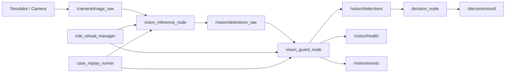
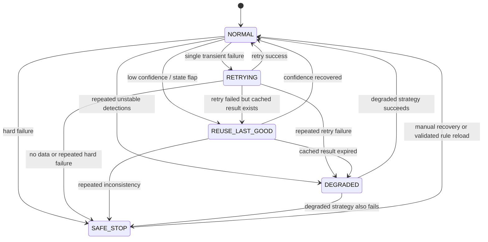

# ROS2 视觉识别仿真场景闭环方案

**创建日期**: 2026-03-31
**适用场景**: ROS2 + 仿真环境 + 视觉识别 + 热重载 + 自纠错
**目标**: 先建立一个可运行、可观测、可热更新、可回滚的最小闭环，再逐步提高鲁棒性

---

## 1. 目标定义

第一版不追求覆盖所有异常，而是先把下面这条链路打通:

```text
仿真相机输入
  -> 视觉识别
  -> 决策输出
  -> 异常捕获
  -> fallback
  -> 日志记录
  -> 热更新修正
  -> 回放验证
```

第一版的最低要求:

- 仿真环境持续发布图像
- 视觉节点输出基础识别结果
- 决策节点根据识别结果产生动作或状态
- 识别链路出错时主流程不中断
- 可在运行中热更新规则和异常处理策略
- 每次失败都能保留上下文并用于后续回放

---

## 2. 分阶段 Plan

### Phase 1: 跑通最小主链路

目标: 先让仿真里的视觉链路完整跑通。

- 启动仿真场景和相机传感器
- 将图像发布到 ROS2 Topic
- 视觉识别节点订阅图像并输出检测结果
- 决策节点根据检测结果发布状态或动作
- 监督节点记录健康状态

交付标准:

- `/camera/image_raw` 持续有数据
- `/vision/detections` 能输出检测结果
- `/vision/health` 能输出识别健康信息

### Phase 2: 建立异常分层

目标: 不把所有错误都堆在一个 `try-catch` 里。

- 输入层异常
- 感知层异常
- 决策层异常
- 执行层异常

交付标准:

- 每类异常都有错误码
- 每类异常都有默认 fallback
- 日志中能区分异常发生层级

### Phase 3: 统一 fallback 策略

目标: 让系统先“可控失败”，再谈“自动修复”。

- `retry`
- `skip`
- `reuse_last_good_result`
- `degrade_mode`
- `safe_stop`

交付标准:

- 单帧异常不会导致主链路崩溃
- 连续异常会进入降级或安全态

### Phase 4: 增加热重载边界

目标: 第一版只热更新规则，不直接热更新核心拓扑。

允许热更新:

- 置信度阈值
- 异常判定规则
- 重试次数
- fallback 映射表

暂不热更新:

- 模型权重本体
- 节点拓扑结构
- 核心状态机代码

交付标准:

- 修改配置后无需重启全系统
- 新规则加载失败时不影响旧规则继续运行

### Phase 5: 补齐可观测性

目标: 让失败可复盘，而不是只看到一句报错。

- 实时日志
- 结构化事件日志
- 失败样本保存
- 当前规则版本记录

交付标准:

- 能定位失败发生在哪一层
- 能知道失败时使用的是哪一版规则
- 能回看触发失败的图像或帧信息

### Phase 6: 建立失败回放闭环

目标: 把“热修复”变成可验证的闭环。

- 保存失败样本
- 修改规则
- 热重载新版本
- 回放失败样本
- 验证修复效果

交付标准:

- 修复后能针对历史失败 case 做回归验证

### Phase 7: 版本化和回滚

目标: 防止热更新越多越难控制。

- 每次规则更新生成版本号
- 运行时记录当前版本
- 保留上一稳定版本
- 新版本异常时支持回滚

交付标准:

- 任意一次规则切换都可追踪
- 新规则失效时可快速回退

### Phase 8: 测试体系

目标: 不只是单元测试，更要做场景回归。

- 单元测试: 配置解析、异常分类、策略匹配
- 集成测试: 节点间消息流
- 场景回放测试: 历史失败 case 回归

---

## 3. ROS2 节点级架构

### 3.1 节点职责划分

建议第一版拆成 6 个模块:

1. `camera_sim_node`
   负责仿真环境中的相机数据输出
2. `vision_inference_node`
   只负责视觉推理和基础检测结果输出
3. `vision_guard_node`
   负责异常判定、健康评估、fallback 执行
4. `decision_node`
   负责根据视觉结果给出动作或业务状态
5. `rule_reload_manager`
   负责规则加载、版本管理、回滚控制
6. `case_replay_runner`
   负责失败样本回放和回归验证

### 3.2 架构图



### 3.3 设计原则

- `vision_inference_node` 只做识别，不做复杂业务判断
- `vision_guard_node` 负责异常分层、fallback 和健康度评估
- `decision_node` 不直接依赖原始图像，只依赖经过 guard 处理的结果
- `rule_reload_manager` 不进入实时主路径，只负责规则装载和版本控制
- `case_replay_runner` 不和在线主链路耦合，主要用于回放与回归

---

## 4. Topic / Service / Action 设计

### 4.1 Topics

建议第一版至少定义以下 Topic:

| Topic | 类型建议 | 发布方 | 订阅方 | 作用 |
|---|---|---|---|---|
| `/camera/image_raw` | `sensor_msgs/msg/Image` | `camera_sim_node` | `vision_inference_node` | 原始相机图像 |
| `/camera/camera_info` | `sensor_msgs/msg/CameraInfo` | `camera_sim_node` | `vision_inference_node` | 相机内参 |
| `/vision/detections_raw` | 自定义或 `vision_msgs` | `vision_inference_node` | `vision_guard_node` | 原始识别输出 |
| `/vision/detections` | 自定义或 `vision_msgs` | `vision_guard_node` | `decision_node` | 经过校验和 fallback 的识别结果 |
| `/vision/health` | 自定义 `VisionHealth` | `vision_guard_node` | `supervisor` / UI | 当前健康状态 |
| `/vision/events` | 自定义 `VisionEvent` | `vision_guard_node` | 日志系统 / 回放系统 | 结构化异常事件 |
| `/decision/result` | 自定义消息 | `decision_node` | 执行层 / 监控层 | 决策输出 |
| `/system/rule_version` | `std_msgs/msg/String` | `rule_reload_manager` | 全系统 | 当前规则版本 |

建议补充两个自定义消息:

- `VisionHealth.msg`
- `VisionEvent.msg`

`VisionHealth.msg` 建议字段:

```text
std_msgs/Header header
string status
string active_mode
string rule_version
int32 consecutive_failures
float32 avg_confidence
string last_error_code
```

`VisionEvent.msg` 建议字段:

```text
std_msgs/Header header
string event_id
string frame_id
string error_layer
string error_code
string severity
string fallback_action
string rule_version
string summary
```

### 4.2 Services

建议第一版定义以下 Service:

| Service | 请求方 | 提供方 | 作用 |
|---|---|---|---|
| `/vision/reload_rules` | 运维 / 开发工具 | `rule_reload_manager` | 重新加载规则配置 |
| `/vision/get_runtime_status` | 运维 / UI | `vision_guard_node` | 获取当前运行状态 |
| `/vision/rollback_rules` | 运维 / 开发工具 | `rule_reload_manager` | 回滚到上一稳定版本 |
| `/vision/save_failure_case` | `vision_guard_node` | `case_replay_runner` 或存储服务 | 保存失败样本 |

`/vision/reload_rules` 请求字段建议:

- `config_path`
- `expected_version`
- `dry_run`

响应字段建议:

- `success`
- `loaded_version`
- `message`

### 4.3 Actions

如果需要较长时序的任务，建议用 Action，而不是滥用 Service。

建议第一版保留两个 Action 入口:

| Action | 客户端 | 服务端 | 作用 |
|---|---|---|---|
| `/vision/replay_case` | 工具端 / UI | `case_replay_runner` | 回放指定失败 case |
| `/vision/validate_rule_set` | 工具端 / UI | `case_replay_runner` 或 `rule_reload_manager` | 批量验证新规则集 |

这样能拿到:

- 进度反馈
- 中途取消
- 最终验证结果

---

## 5. 最小闭环模板映射

把前面提到的“最小闭环模板”映射到 ROS2 模块:

| 闭环能力 | 对应模块 |
|---|---|
| 错误分层 | `vision_guard_node` |
| 统一 fallback | `vision_guard_node` |
| 可观测日志 | `vision_guard_node` + 日志存储 |
| 热更新保护 | `rule_reload_manager` |
| 回滚机制 | `rule_reload_manager` |
| 失败样本回放 | `case_replay_runner` |

---

## 6. 异常分类表

### 6.1 输入层异常

| 错误码 | 触发条件 | 影响 | 默认 fallback |
|---|---|---|---|
| `INPUT.NO_FRAME` | 指定时间窗口内没有新帧 | 无法继续识别 | `retry` 后进入 `safe_stop` |
| `INPUT.FRAME_DELAY` | 帧时间戳过旧 | 识别结果可能失真 | `skip` |
| `INPUT.BAD_FORMAT` | 编码格式或尺寸异常 | 推理无法执行 | `skip` |
| `INPUT.SIM_GLITCH` | 仿真相机异常抖动或黑屏 | 结果不可信 | `degrade_mode` |

### 6.2 感知层异常

| 错误码 | 触发条件 | 影响 | 默认 fallback |
|---|---|---|---|
| `PERCEPTION.INFER_FAIL` | 推理过程抛异常 | 本帧无结果 | `retry` |
| `PERCEPTION.LOW_CONF` | 结果低于阈值 | 结果不稳定 | `reuse_last_good_result` |
| `PERCEPTION.BOX_JITTER` | 连续多帧检测框剧烈抖动 | 目标跟踪不稳定 | `degrade_mode` |
| `PERCEPTION.MULTI_CONFLICT` | 多个候选目标冲突 | 无法稳定决策 | `skip` 或人工确认 |

### 6.3 决策层异常

| 错误码 | 触发条件 | 影响 | 默认 fallback |
|---|---|---|---|
| `DECISION.STATE_FLAP` | 状态来回跳变 | 下游行为抖动 | `reuse_last_good_result` |
| `DECISION.RULE_MISMATCH` | 识别结果与业务规则冲突 | 决策不可信 | `degrade_mode` |
| `DECISION.CONTEXT_MISSING` | 关键上下文缺失 | 无法生成稳定动作 | `safe_stop` |

### 6.4 执行层异常

| 错误码 | 触发条件 | 影响 | 默认 fallback |
|---|---|---|---|
| `EXEC.DOWNSTREAM_TIMEOUT` | 下游节点未在时限内响应 | 动作链路中断 | `retry` |
| `EXEC.PUBLISH_FAIL` | 结果消息发布失败 | 状态无法传递 | `retry` |
| `EXEC.ACTION_REJECTED` | 下游动作拒绝执行 | 链路失效 | `safe_stop` |

### 6.5 配置与热更新异常

| 错误码 | 触发条件 | 影响 | 默认 fallback |
|---|---|---|---|
| `RULE.INVALID_FORMAT` | 新配置解析失败 | 无法加载新规则 | 保持旧版本 |
| `RULE.UNSAFE_THRESHOLD` | 新阈值超出安全范围 | 可能导致误判 | 保持旧版本 |
| `RULE.VERSION_CONFLICT` | 版本号冲突或回退混乱 | 规则状态不可追踪 | 保持旧版本 |

---

## 7. Fallback 状态机

### 7.1 核心状态

建议 `vision_guard_node` 内部维持以下状态:

- `NORMAL`
- `RETRYING`
- `REUSE_LAST_GOOD`
- `DEGRADED`
- `SAFE_STOP`

### 7.2 状态迁移图



### 7.3 状态机规则

`NORMAL`

- 正常输出识别结果
- 记录滑动窗口统计
- 持续监控低置信度、抖动、超时

`RETRYING`

- 适用于瞬时失败
- 限制最大重试次数，例如 `max_retry = 2`
- 超限后进入 `REUSE_LAST_GOOD` 或 `DEGRADED`

`REUSE_LAST_GOOD`

- 当前帧不可信时，复用最近一次可信结果
- 必须限制缓存有效期，例如 `cache_ttl_ms = 500`
- 过期后不能继续复用

`DEGRADED`

- 从复杂识别切换到简单规则模式
- 例如从目标检测切换到颜色阈值或区域判定
- 降级模式也必须可观测

`SAFE_STOP`

- 停止向下游输出高风险结果
- 发布健康状态为不可用
- 等待人工恢复或已验证的新规则恢复

### 7.4 状态切换阈值建议

第一版可先用固定阈值:

| 条件 | 建议阈值 |
|---|---|
| 单次推理失败重试次数 | 2 |
| 连续低置信度触发降级 | 5 帧 |
| 连续无图像触发安全停机 | 10 帧 |
| 最近可信结果缓存有效期 | 500 ms |
| 新规则灰度验证样本数 | 20 个 case |

---

## 8. 热重载设计边界

### 8.1 建议热更新的内容

- `confidence_threshold`
- `max_retry`
- `low_conf_trigger_count`
- `safe_stop_trigger_count`
- `fallback_mapping`
- `degraded_mode_selector`

### 8.2 不建议第一版热更新的内容

- 模型文件路径
- 模型框架切换
- 节点生命周期和拓扑重建
- 主状态机代码逻辑

### 8.3 热重载流程

```text
开发者修改规则文件
  -> rule_reload_manager 解析配置
  -> 进行 schema 校验和安全阈值校验
  -> 生成新版本号
  -> 小范围灰度生效
  -> case_replay_runner 验证关键失败样本
  -> 通过则切换为正式版本
  -> 失败则自动回滚旧版本
```

---

## 9. 可观测性与失败样本

### 9.1 每次异常至少记录这些字段

- 时间戳
- `frame_id`
- 输入来源
- 检测结果摘要
- 置信度
- 错误层级
- 错误码
- fallback 动作
- 当前规则版本
- 最近 N 帧统计值

### 9.2 失败样本建议保存内容

- 原始图像帧或短片段
- 仿真时刻或场景编号
- 相机参数
- 原始识别输出
- guard 处理结果
- 触发异常的规则版本
- 期望结果和实际结果

---

## 10. 第一版里程碑

建议按下面顺序交付:

1. 打通仿真相机到视觉识别再到决策输出
2. 引入 `vision_guard_node` 做异常分层
3. 实现统一 fallback 状态机
4. 实现规则热重载和版本记录
5. 保存结构化事件和失败样本
6. 实现失败样本回放
7. 加入规则回滚机制

---

## 11. 下一步实现建议

如果开始落代码，建议先做这三件事:

1. 先定义 `VisionHealth.msg` 和 `VisionEvent.msg`
2. 先实现 `vision_guard_node`，不要把 fallback 逻辑塞进推理节点
3. 先做规则文件和版本管理，再考虑更激进的热更新能力

这套方案的关键不在于“异常全覆盖”，而在于先建立:

- 失败不中断
- 失败可观测
- 修复可热加载
- 修复可验证
- 新规则可回滚

这样后续你加 `try-catch`、补异常方法、补策略规则，都会进入一个可持续演化的工程闭环，而不是零散补丁。
