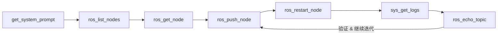

# EdgeMCP 迁移到 ROS + Jetson 平台设计方案

**文档版本**: v1.0
**创建日期**: 2026-03-08
**目标**: 将 EdgeMCP 的核心理念迁移到 ROS2 + Jetson 平台，面向英伟达技术栈

---

## 目录

1. [项目背景](#项目背景)
2. [核心理念](#核心理念)
3. [架构设计](#架构设计)
4. [解决的问题](#解决的问题)
5. [技术实现](#技术实现)
6. [应用场景](#应用场景)
7. [与英伟达生态的结合](#与英伟达生态的结合)
8. [实施路线图](#实施路线图)

---

## 项目背景

### EdgeMCP 当前架构

**Kongnitive EdgeMCP** 是一个运行在 ESP32 上的 MCP Server，核心特点：

- **稳定固件层**: MCP Server、传输层、Lua VM、硬件驱动
- **热更新业务层**: SPIFFS 中的 Lua 脚本
- **AI 自迭代**: AI 通过 MCP 工具远程读取日志、推送脚本、验证效果

```
AI Agent → MCP Server (ESP32) → Lua VM → 硬件驱动
                ↓
         SPIFFS 脚本存储
```

### 迁移动机

1. **性能提升**: Jetson 提供 GB 级内存和 GPU 算力
2. **生态成熟**: ROS2 在机器人/自动驾驶领域广泛应用
3. **商业价值**: 面向英伟达技术栈，适合企业级应用
4. **复杂场景**: 支持 SLAM、目标检测、路径规划等高级功能

---

## 核心理念

### 不变的核心思想

**稳定基座 + 灵活业务层 + AI 自迭代**

无论是 ESP32 还是 Jetson，核心理念保持一致：
- 固件/基座层保持稳定，负责平台能力
- 业务逻辑层可热更新，快速迭代
- AI 通过 MCP 工具自主闭环优化

### 架构对比

| 层级 | ESP32 版本 | Jetson 版本 |
|------|-----------|------------|
| 硬件 | ESP32 | Jetson Nano/Xavier/Orin |
| OS | FreeRTOS | Ubuntu + JetPack |
| 通信 | HTTP | HTTP/WebSocket |
| 运行时 | Lua 5.4 | Python 3.8+ |
| 框架 | 无 | ROS2 Humble/Iron |
| AI 推理 | 无 | TensorRT/CUDA |
| 存储 | SPIFFS | 文件系统 |

---

## 架构设计

### 整体架构

```
AI Agent → MCP Server (Jetson) → ROS2 节点管理器 → 动态加载的 Python 节点
                ↓                        ↓
         节点脚本存储              GPU 推理引擎 (TensorRT)
                                        ↓
                                  ROS 话题/服务/动作
```

### 三层架构

#### 1. 稳定基座层（对应当前固件）

运行在 Jetson 上的稳定组件：

- **MCP Server**: HTTP/WebSocket 端点，处理 AI 请求
- **ROS2 Core**: DDS 通信层，节点间通信
- **节点生命周期管理器**: 动态加载/卸载 Python 节点
- **TensorRT 推理引擎**: GPU 加速的 AI 模型推理
- **硬件抽象层**: 摄像头、激光雷达、IMU 等驱动

#### 2. 热更新业务层（对应当前 Lua 脚本）

可通过 MCP 工具远程更新的 Python ROS2 节点：

- **感知节点**: 目标检测、语义分割、SLAM
- **规划节点**: 路径规划、行为树
- **控制节点**: 运动控制、PID 调参
- **决策节点**: 状态机、任务调度

#### 3. MCP 工具层

**系统类**（类似原有）：
- `get_status`: CPU/GPU/内存/温度/ROS 节点状态
- `get_system_prompt`: 项目级 AI 指令
- `sys_get_logs`: ROS 日志 + 系统日志
- `sys_reboot`: 重启系统

**ROS 节点管理**（替代 Lua 工具）：
- `ros_list_nodes`: 列出当前运行的节点
- `ros_push_node`: 上传新的 Python 节点脚本
- `ros_get_node`: 读取节点源码
- `ros_start_node`: 启动节点
- `ros_stop_node`: 停止节点
- `ros_restart_node`: 重启节点

**ROS 通信**（新增）：
- `ros_list_topics`: 列出话题
- `ros_echo_topic`: 监听话题数据
- `ros_pub_topic`: 发布测试数据
- `ros_call_service`: 调用服务

**GPU 推理**（英伟达特色）：
- `gpu_list_models`: 列出已部署的 TensorRT 模型
- `gpu_push_model`: 上传新模型（ONNX → TensorRT）
- `gpu_infer`: 执行推理测试
- `gpu_profile`: 性能分析

**依赖注入**（保留 DI 思想）：
- `ros_bind_dependency`: 切换节点实现（如切换 SLAM 算法）

### AI 自迭代闭环



---

## 解决的问题

### 1. 迭代周期长，调试效率低

**现状问题**：
```
修改代码 → 编译 → 部署到 Jetson → 重启节点 → 测试 → 发现问题 → 重复
```
- 每次改动都要重新编译、部署
- 现场调试时无法快速修改参数
- 多台设备需要逐个更新

**EdgeMCP 方案解决**：
```
AI 读取日志 → 分析问题 → 推送新脚本 → 热重启节点 → 验证 → 继续迭代
```
- 无需重新编译
- AI 可以远程自主迭代
- 一次推送，多台设备同步更新

### 2. 现场问题难以远程修复

**实际场景**：
- 仓储机器人在客户现场卡住了
- 自动驾驶车辆遇到新的边缘情况
- 无人机在野外任务中行为异常

**传统方案**：
- 派工程师现场调试（成本高、时间长）
- 或者让客户重新烧录固件（风险大、体验差）

**EdgeMCP 方案**：
- AI 通过 MCP 工具远程读取日志
- 分析问题后推送修复脚本
- 实时验证，无需现场介入

### 3. AI 模型更新困难

**现状问题**：
- TensorRT 模型更新需要重新部署整个应用
- 模型版本管理混乱
- A/B 测试困难

**EdgeMCP 方案**：
```python
# AI 可以通过 MCP 工具直接操作
gpu_push_model("yolov8n.onnx")  # 上传新模型
gpu_profile("yolov8n")          # 性能测试
ros_bind_dependency(            # 切换到新模型
    interface="detector",
    provider="yolov8n"
)
sys_get_logs()                  # 验证效果
```

### 4. 多设备管理复杂

**实际场景**：
- 100 台配送机器人需要更新导航算法
- 10 台自动驾驶车辆需要调整感知参数

**传统方案**：
- 手动 SSH 到每台设备
- 或者用 Ansible/Kubernetes（复杂度高）

**EdgeMCP 方案**：
- 每台 Jetson 暴露 MCP 端点
- AI 批量管理：`for device in fleet: mcp_call(device, "ros_push_node", ...)`
- 类似英伟达的 Fleet Command，但更轻量

### 价值对比

| 维度 | 传统方案 | EdgeMCP 方案 |
|------|---------|-------------|
| 迭代速度 | 小时/天 | 分钟 |
| 远程修复 | 困难 | 容易 |
| AI 参与度 | 低（人工主导） | 高（AI 自主迭代） |
| 多设备管理 | 复杂 | 简单 |
| 模型更新 | 需要重新部署 | 热插拔 |
| 学习曲线 | 陡峭（需要懂 ROS/CMake） | 平缓（AI 辅助） |

---

## 技术实现

### ROS2 原生节点加载机制

**编译时**：
```bash
# ROS2 使用 colcon 构建系统
colcon build --packages-select my_robot_pkg

# 生成的结构
install/
  my_robot_pkg/
    lib/
      my_robot_pkg/
        detector_node      # C++ 编译的可执行文件
    share/
      my_robot_pkg/
        launch/
        config/
```

**运行时**：
```bash
# 启动节点（传统方式）
ros2 run my_robot_pkg detector_node

# 或者用 launch 文件
ros2 launch my_robot_pkg robot.launch.py
```

**限制**：
- C++ 节点：编译成二进制，修改后必须重新编译
- Python 节点：虽然是脚本，但通过 `setup.py` 安装到 `install/` 目录
- 节点生命周期：启动后独立进程，修改代码需要重启

### 热加载方案

#### 方案 1：基于 Python 动态导入（推荐）

**核心思路**：不是热加载"节点进程"，而是热加载"节点逻辑"

```python
# node_manager.py - 常驻的节点管理器
import rclpy
from rclpy.node import Node
import importlib
import sys
import threading

class NodeManager(Node):
    def __init__(self):
        super().__init__('node_manager')
        self.active_nodes = {}  # {node_name: node_instance}
        self.node_modules = {}  # {node_name: module}

    def load_node(self, node_name, module_path):
        """动态加载节点"""
        # 1. 导入模块
        if module_path in sys.modules:
            # 重新加载已存在的模块
            module = importlib.reload(sys.modules[module_path])
        else:
            module = importlib.import_module(module_path)

        # 2. 获取节点类
        NodeClass = getattr(module, 'Node')  # 假设类名是 Node

        # 3. 实例化节点
        node_instance = NodeClass()

        # 4. 在新线程中 spin
        thread = threading.Thread(
            target=rclpy.spin,
            args=(node_instance,),
            daemon=True
        )
        thread.start()

        # 5. 保存引用
        self.active_nodes[node_name] = {
            'instance': node_instance,
            'thread': thread,
            'module': module
        }

    def unload_node(self, node_name):
        """卸载节点"""
        if node_name in self.active_nodes:
            node_info = self.active_nodes[node_name]
            node_info['instance'].destroy_node()
            # 线程会自动退出
            del self.active_nodes[node_name]

    def reload_node(self, node_name, module_path):
        """热重载节点"""
        self.unload_node(node_name)
        self.load_node(node_name, module_path)
```

**MCP 工具实现**：
```python
def mcp_ros_push_node(node_name, script_content):
    # 1. 保存脚本到文件系统
    script_path = f"/opt/ros_nodes/{node_name}.py"
    with open(script_path, 'w') as f:
        f.write(script_content)

    # 2. 通知 NodeManager 重新加载
    manager.reload_node(node_name, f"ros_nodes.{node_name}")

    return {"status": "success"}
```

#### 方案 2：基于 ROS2 Lifecycle Nodes

ROS2 提供了生命周期节点（Lifecycle Nodes），支持状态转换：

```python
from rclpy.lifecycle import Node, State, TransitionCallbackReturn

class ManagedDetectorNode(Node):
    def __init__(self):
        super().__init__('detector')

    def on_configure(self, state: State):
        """配置阶段 - 可以重新加载参数"""
        self.load_config()
        return TransitionCallbackReturn.SUCCESS

    def on_activate(self, state: State):
        """激活阶段 - 开始工作"""
        self.start_processing()
        return TransitionCallbackReturn.SUCCESS

    def on_deactivate(self, state: State):
        """停用阶段 - 停止工作但不销毁"""
        self.stop_processing()
        return TransitionCallbackReturn.SUCCESS

    def on_cleanup(self, state: State):
        """清理阶段"""
        self.cleanup_resources()
        return TransitionCallbackReturn.SUCCESS
```

**状态转换**：
```
Unconfigured → Inactive → Active → Inactive → Unconfigured
     ↓            ↓          ↓         ↓           ↓
  configure   activate  deactivate  cleanup   shutdown
```

**热更新流程**：
```python
def mcp_ros_reload_node(node_name):
    # 1. 停用节点（不销毁）
    lifecycle_client.change_state(node_name, 'deactivate')

    # 2. 清理资源
    lifecycle_client.change_state(node_name, 'cleanup')

    # 3. 重新加载代码（通过 importlib.reload）
    reload_node_code(node_name)

    # 4. 重新配置
    lifecycle_client.change_state(node_name, 'configure')

    # 5. 重新激活
    lifecycle_client.change_state(node_name, 'activate')
```

#### 方案 3：基于 ROS2 Component

ROS2 支持"可组合节点"（Composable Nodes），可以在同一进程中动态加载/卸载：

```python
from rclpy.components import ComponentManager

manager = ComponentManager()

# 动态加载
manager.load_component(
    package_name='my_robot_pkg',
    plugin_name='DetectorComponent'
)

# 动态卸载
manager.unload_component(component_id)
```

### 方案对比

| 方案 | 优点 | 缺点 | 适用场景 |
|------|------|------|---------|
| 动态导入 | 简单、灵活 | 需要自己管理线程 | 快速原型 |
| Lifecycle Nodes | 官方支持、状态清晰 | 需要节点实现生命周期接口 | 生产环境 |
| Component | 性能好、进程内通信 | 复杂度高 | 高性能场景 |

### GPU 模型热更新

```python
import tensorrt as trt

def mcp_gpu_push_model(model_name, onnx_content):
    # 1. 保存 ONNX 文件
    onnx_path = f"/tmp/{model_name}.onnx"
    with open(onnx_path, 'wb') as f:
        f.write(onnx_content)

    # 2. ONNX → TensorRT 转换
    engine = build_tensorrt_engine(onnx_path)

    # 3. 保存 TensorRT 引擎
    engine_path = f"/opt/models/{model_name}.trt"
    save_engine(engine, engine_path)

    # 4. 通知推理节点重新加载
    ros_restart_node(f"perception/{model_name}")

    return {"status": "success", "engine_path": engine_path}
```

---

## 应用场景

### 场景 1：自动驾驶车队

**问题**：车辆在某个路口频繁误刹车

**传统方案**：
1. 收集数据
2. 回公司分析
3. 修改代码
4. 重新编译
5. 召回车辆更新
6. 耗时：数天到数周

**EdgeMCP 方案**：
1. AI 远程读取日志：`sys_get_logs()`
2. 分析问题：感知阈值过于保守
3. 推送修复：`ros_push_node("perception/detector.py")`
4. 验证效果：`ros_echo_topic("/detections")`
5. 耗时：数分钟

### 场景 2：仓储机器人

**问题**：新仓库布局，需要调整导航参数

**传统方案**：
- 工程师现场调参
- 或者远程 SSH 手动修改配置文件

**EdgeMCP 方案**：
```python
# AI 自主调参
for cost_weight in [0.5, 1.0, 1.5]:
    ros_push_node("navigation/planner.py",
                  params={"cost_weight": cost_weight})
    ros_restart_node("navigation/planner")
    # 测试 10 次导航任务
    results = test_navigation(10)
    # 选择最优参数
```

### 场景 3：农业无人机

**问题**：不同作物需要不同的识别模型

**EdgeMCP 方案**：
```python
# 根据作物类型动态切换模型
if crop_type == "wheat":
    gpu_push_model("wheat_detector.trt")
elif crop_type == "corn":
    gpu_push_model("corn_detector.trt")

ros_bind_dependency(
    interface="crop_detector",
    provider=f"{crop_type}_detector"
)
```

---

## 与英伟达生态的结合

### 1. 降低 Jetson 使用门槛
- 不需要深入理解 ROS2 编译系统
- AI 辅助开发，加速原型验证
- 吸引更多非专业开发者

### 2. 展示 TensorRT 的灵活性
- 模型可以像"插件"一样热插拔
- 方便 A/B 测试和性能对比
- 突出 Jetson 的边缘 AI 优势

### 3. 配合英伟达产品

#### Isaac ROS
- 加速的 ROS2 节点可以通过 MCP 管理
- 例如：`ros_bind_dependency(interface="stereo_depth", provider="isaac_ess")`

#### TAO Toolkit
- 训练完直接推送到设备
- `gpu_push_model("tao_trained_model.onnx")`

#### Omniverse
- 仿真环境中测试脚本更新
- 验证后再推送到真实设备

#### Fleet Command
- 企业级设备管理的补充
- EdgeMCP 提供更细粒度的节点级控制

### 4. 新的商业模式

- **AI-as-a-Service**: AI 持续优化设备行为
- **远程运维**: 减少现场服务成本
- **快速迭代**: 缩短产品上市时间
- **订阅服务**: 按需更新算法和模型

---

## 实施路线图

### Phase 1: PoC 验证（2-4 周）

**目标**：在 Jetson Nano 上验证核心概念

**任务**：
1. 搭建基础 MCP Server（Flask + ROS2）
2. 实现简单的节点热加载（动态导入方案）
3. 部署一个 TensorRT 目标检测模型
4. 实现 5 个核心 MCP 工具：
   - `get_status`
   - `ros_list_nodes`
   - `ros_push_node`
   - `ros_restart_node`
   - `sys_get_logs`
5. 演示 AI 自主调整检测阈值

**交付物**：
- 可运行的 Demo
- 技术验证报告

### Phase 2: 完整实现（1-2 个月）

**目标**：实现生产级功能

**任务**：
1. 实现所有 20+ MCP 工具
2. 支持 Lifecycle Nodes 和 Component
3. GPU 模型热更新
4. 依赖注入系统
5. 多设备管理
6. 安全认证机制

**交付物**：
- 完整的 ROS2 包
- API 文档
- 用户手册

### Phase 3: 生态集成（2-3 个月）

**目标**：与英伟达生态深度集成

**任务**：
1. Isaac ROS 节点支持
2. TAO Toolkit 集成
3. Omniverse 仿真测试
4. Fleet Command 对接
5. 性能优化

**交付物**：
- 集成方案文档
- 最佳实践指南
- 性能测试报告

### Phase 4: 商业化（持续）

**目标**：推广和商业化

**任务**：
1. 开源社区建设
2. 企业客户试点
3. 培训和技术支持
4. 持续优化和迭代

---

## 总结

### 核心价值

EdgeMCP 迁移到 ROS + Jetson 平台，解决的核心问题是：**让边缘 AI 设备具备自我进化能力**。

传统的 ROS + Jetson 开发，每次改动都要重新编译、部署，现场问题难以远程修复。EdgeMCP 方案把固件和业务逻辑分离，AI 可以通过 MCP 协议远程读取日志、推送脚本、切换模型，实现快速迭代。

### 对英伟达的价值

1. **降低 Jetson 使用门槛**，吸引更多开发者
2. **展示 TensorRT 的灵活性**，模型可以像插件一样热插拔
3. **配合 Isaac ROS、TAO Toolkit 等生态**，形成完整的 AI 开发闭环
4. **支持新的商业模式**，比如 AI-as-a-Service 远程运维

### 技术亮点

- **热加载机制**：基于 Python 动态导入和 ROS2 Lifecycle Nodes
- **GPU 模型管理**：TensorRT 模型热插拔
- **AI 自迭代闭环**：从日志分析到脚本推送的完整流程
- **多设备管理**：轻量级的 Fleet 管理方案

---

**文档维护者**: EdgeMCP Team
**最后更新**: 2026-03-08

